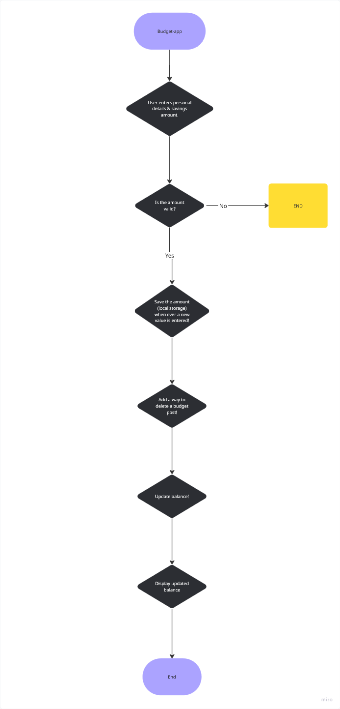

# Budget-app 💰

**Flow chart**

**User fills in there personal information**

START

DISPLAY form for personal information
-GET user name
-GET user age
-GET user currency preference (optional)

IF required fields are empty
    DISPLAY error message
    STOP
END IF

**User fills in there income and savings information**

DISPLAY income input field
GET monthly income

DISPLAY savings input field
GET savings amount

IF income or savings is not a number OR less then 0
    DISPLAY error message
    STOP
END if

**Save the users information in local storage**

CREATE user object with:
    personal information
    income
    savings
    empty lis of budget posts

SAVE user object to local storage

**Make a function for the user to be able to delete budget posts**

WHEN user clicks delete on a budget post
    FIND selected budget post 
    REMOVE budget post from list
    UPDATE local storage
    RECALCULATE balance
    DISPLAY updated balance
END

**Make function to calculate the balance**

SET total expenses to 0
    ADD post amount to total expenses
END FOR

SET balance to income minus total expenses
RETURN balance

**Make it so user can see the total balance**

CALL calculate balance function 
DISPLAY balance to user

IF balance is less than 0
    DISPLAY warning message
END IF